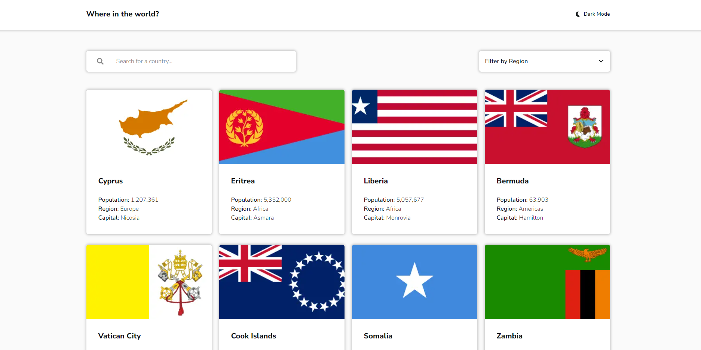
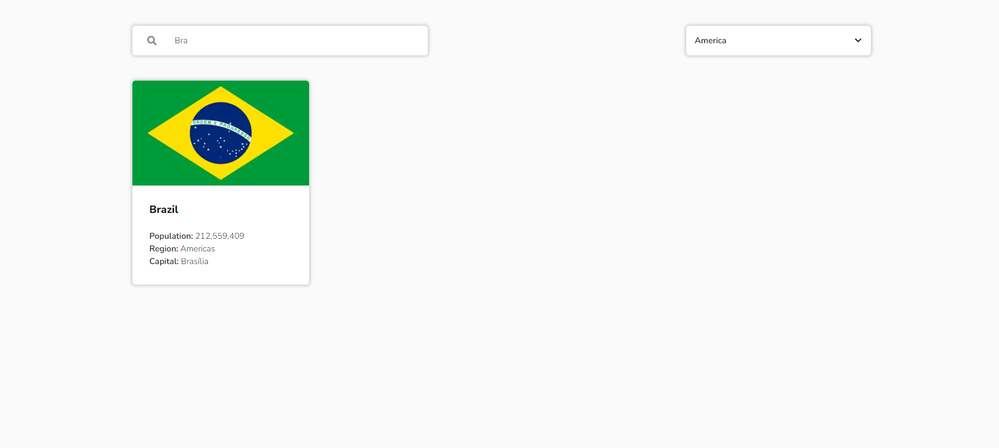
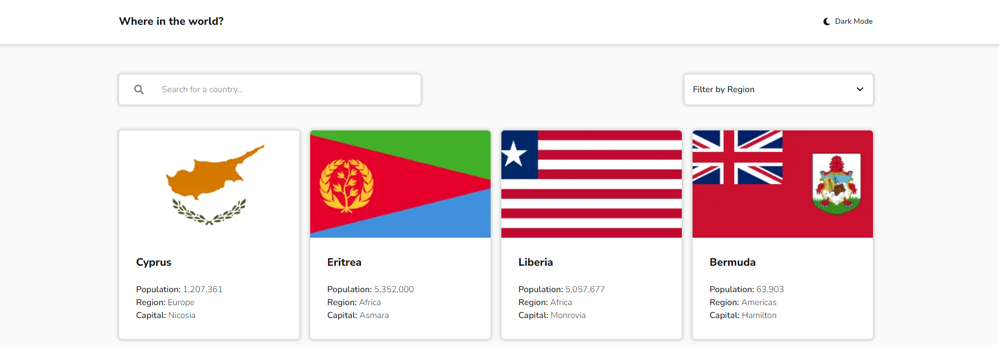
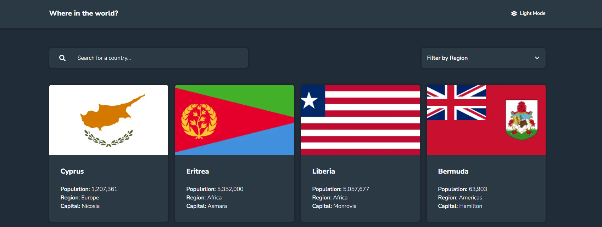
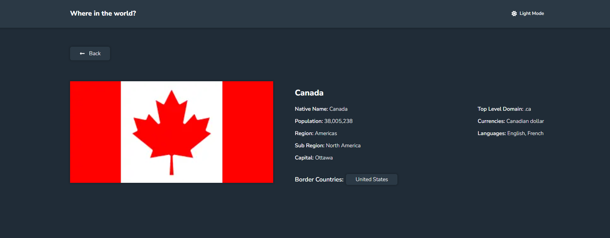

# Countries Information



## Table of Contents

- [About the project](#about-the-project)
- [Features](#features)
  - [Filters](#filters)
  - [Theme Switcher](#theme-switcher)
  - [Routes](#routes)
- [Built with](#built-with)
- [Run the application](#run-the-application)
- [Author](#author)

## About the project

This is a solution to the [REST Countries API](https://www.frontendmentor.io/challenges/rest-countries-api-with-color-theme-switcher-5cacc469fec04111f7b848ca). The main challenge is to create an application where the user will be able to filter the countries and gathering information about them. This will be possible by using the [REST countries API](https://restcountries.com/).

## Features

The application has the following features:

### Filters



- **Country Filter**: The user will be able to filter the country they are looking for just by typing the country name.

- **Region Filter**: The user will be able to filter the countries based on the region of their choice.

### Theme Switcher

The application has a theme switcher that can be toggled to dark or white, and the theme chosen is stored in the local storage.

Home - _light theme_

Home - _dark theme_


### Routes



Since the application was made with the Next.js framework, see the following routes that were created:

- **Home Page**: It's the first page that the user sees when entering the application. On this page, you will be able to see the countries and some basic information about them. It's also possible to navigate to another page by clicking on the country of choice and seeing more detailed information about the country that was chosen.

- **Country details**: This page shows dynamically, in more detail, the country that was chosen by the user on the home page. Also on this page, you can navigate to another country details page by clicking on the borders of the country.

## Built with

This project was built with the following technologies:

- [Next.js](https://nextjs.org/)
- [React](https://react.dev/)
- [TypeScript](https://www.typescriptlang.org/)
- [Tailwind](https://tailwindcss.com/)
- [React Icons](https://react-icons.github.io/react-icons/)

## Run the application

To run the application on your machine, follow the next steps:

1. Clone the repositorie

   ```sh
   git clone https://github.com/JhowBRCG/countries-information.git
   ```

2. Install the dependencies

   ```sh
   npm install
   ```

3. Initialize the server

   ```sh
   npm run dev
   ```

4. Now you can see the application in real time by putting the url http://localhost:3000/ in the browser of your choice.

## Author

Created by [@jhowbrcg](https://github.com/JhowBRCG) - fell free to contact me!

## License

This project is licensed under [MIT](https://opensource.org/licenses/MIT) license.
